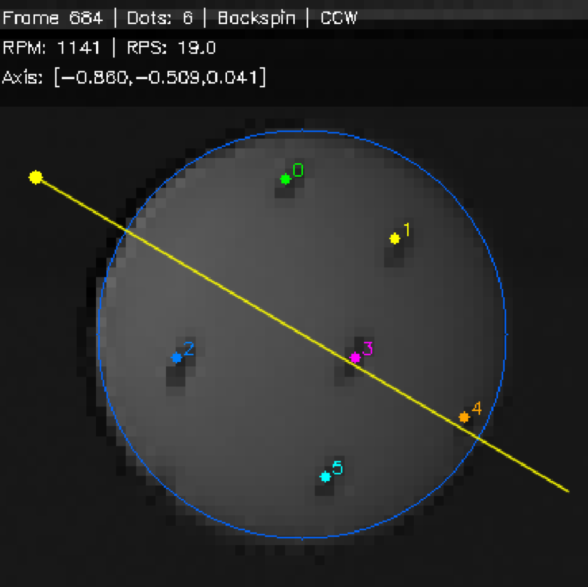

# Table Tennis Spin Calculation



Automated table tennis ball spin measurement from high-speed camera video. Uses a CNN heatmap regression model for dot detection, 3D spherical projection, Kabsch rigid rotation, and interactive visualization.

---

## Measurement Principle

### 1. Ball Localization & Cropping

From high-speed video, background subtraction finds the frames where the ball appears. Hough circle detection locates the ball center and pixel radius. The ball region is cropped to 60×60 pixels.

### 2. CNN Dot Detection

A pre-trained DotNet (fully convolutional heatmap regression network) processes the 60×60 ball image to produce a dot heatmap. Each black dot on the ball corresponds to a Gaussian peak in the heatmap. Non-maximum suppression extracts 2D pixel coordinates.

### 3. 2D → 3D Projection

Using calibrated camera intrinsics (pinhole model), each 2D dot coordinate is projected onto the ball surface via ray-sphere intersection. The result is a set of 3D vectors on the unit sphere, centered at the ball origin.

### 4. Cross-Frame Matching

Between consecutive frames, the same physical dot moves very little in 3D space on the unit sphere. Hungarian algorithm performs greedy nearest-neighbor matching in 3D, assigning a persistent global ID to each dot.

### 5. Kabsch Rotation Computation

For each 3-frame sliding window with >=3 commonly-tracked dots, the Kabsch algorithm computes the optimal rotation matrix between frames. The Kabsch implementation does NOT subtract the centroid (the points are already ball-center-relative vectors), ensuring the rotation axis passes through the ball center. Global axis alignment + median filtering removes outliers.

Output:
- **RPM** (revolutions per minute) & **RPS** (revolutions per second)
- **Rotation axis** (3D unit vector)
- **Spin type** (topspin / backspin / sidespin / gyro)
- **Spin direction** (clockwise / counter-clockwise)

---

## Coordinate System

```
+X : image right
+Y : image down
+Z : camera forward (away from camera)
```

The 3D visualization shows the rotation axis as a cyan arrow. +Z direction indicates counter-clockwise (CCW) rotation when viewed from the camera.

---

## Project Structure

```
Table-Tennis-Spin-Calculation/
├── spinCal/              # Core spin measurement package
│   ├── main.py           # CLI entry point
│   ├── config.py         # Camera parameters & thresholds
│   ├── geometry.py       # 3D geometry (ray-sphere, Kabsch)
│   ├── model.py          # DotNet CNN definition
│   ├── detection.py      # Per-frame processing
│   ├── matching.py       # 3D proximity matching & ID tracking
│   ├── rotation.py       # 3-frame window Kabsch + median filter
│   ├── video.py          # AVI → cropped frames
│   └── viz.py            # Interactive viewer & 3D sphere plot
│
├── getData/              # Data production pipeline
│   ├── extract.py        # Batch AVI → ball ROI extraction
│   ├── label.py          # Manual dot labeling tool
│   └── augment.py        # Data augmentation (flip/rotate/brightness/noise)
│
├── dotnet/               # Model training
│   ├── model.py          # DotNet architecture
│   ├── dataset.py        # Heatmap regression dataset
│   └── train.py          # Training script
│
├── spinCal.png           # Screenshot
└── README.md             # This file
```

---

## Usage

### One-Step Measurement (Recommended)

```bash
# From AVI video
python -m spinCal.main <the path of video.avi>

# From image folder
python -m spinCal.main <the path of image folder> --model <the path of dotnet.pt>

# Skip interactive viewer
python -m spinCal.main <the path of video.avi> --no-viz
```

### Custom Training Workflow

If you need to train on your own labeled data:

```bash
# 1. Extract frames from videos
python getData/extract.py <the path of video directory>

# 2. Label black dots (left-click=add, right-click=undo, ENTER=next)
python getData/label.py <the path of dataset directory>

# 3. Data augmentation
python getData/augment.py <the path of dataset directory>

# 4. Train model
python dotnet/train.py <the path of dataset directory> --epochs 100

# 5. Measure spin with new model
python -m spinCal.main <the path of video.avi> --model <the path of dotnet.pt>
```

---

## Adjustable Parameters

In `spinCal/config.py`:

| Parameter | Default | Description |
|-----------|---------|-------------|
| `MATCH_MAX_DISP` | 0.5 | Max 3D displacement for dot matching |
| `CNN_HMAP_THRESH` | 0.3 | CNN heatmap detection threshold |
| `HOUGH_PARAM1` | 40 | Hough circle Canny threshold |
| `HOUGH_PARAM2` | 25 | Hough circle accumulator threshold |

Or override via CLI: `--match-disp 0.3`

---

## Dependencies

- Python >= 3.10
- PyTorch + CUDA
- OpenCV
- NumPy, SciPy
- Matplotlib
- scikit-learn

---

## References

- Kabsch, W. (1976). "A solution for the best rotation to relate two sets of vectors"
- SpinDOE: Gossard et al., "A ball spin estimation method for table tennis robot", arXiv:2303.03879
